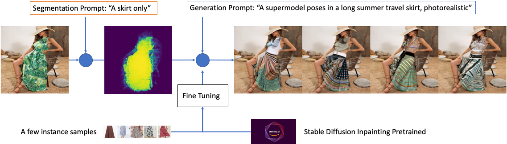

## Virtual Fashion Styling With Generative AI Using SageMaker 

The fashion industry is a highly lucrative business, with an estimated value of $2.1 trillion by 2025, as reported by the World Bank. This field encompasses a diverse range of segments, such as the creation, manufacture, distribution, and sales of clothing, shoes, and accessories. The industry is in a constant state of change, with new styles and trends appearing frequently. Therefore, fashion companies must be flexible and able to adapt in order to maintain their relevance and achieve success in the market.

Generative Artificial Intelligence (AI) refers to AI algorithms designed to generate new content, such as images, text, audio, or video, based on a set of learned patterns and data. It can be utilized to generate new and innovative apparel designs while offering improved personalization and cost-effectiveness. AI-driven design tools can create unique apparel designs based on input parameters or styles specified by potential customers through text prompts. Furthermore, AI can be utilized to personalize designs to the customer's preferences. For example, a customer could select from a variety of colors, patterns, and styles, and AI models would generate a one-of-a-kind design based on those selections. The adoption of AI in the fashion industry is currently hindered by various technical, feasibility, and cost challenges. However, these obstacles can now be mitigated by utilizing advanced generative AI methods such as natural language-based image semantic segmentation and diffusion for virtual styling.

This blog post details the implementation of generative AI-assisted fashion online styling using text prompt. Machine learning engineers can fine-tune and deploy text-to-semantic-segmentation and in-painting models based on pre-trained CLIPSeq and Stable Diffusion with Amazon SageMaker. This enables fashion designers and consumers to create virtual modeling images based on text prompts and choose preferred styles.  

